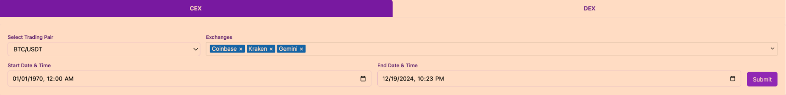
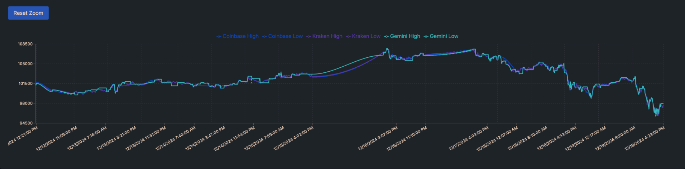
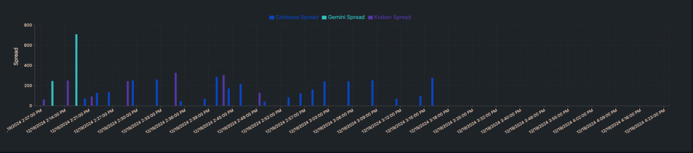
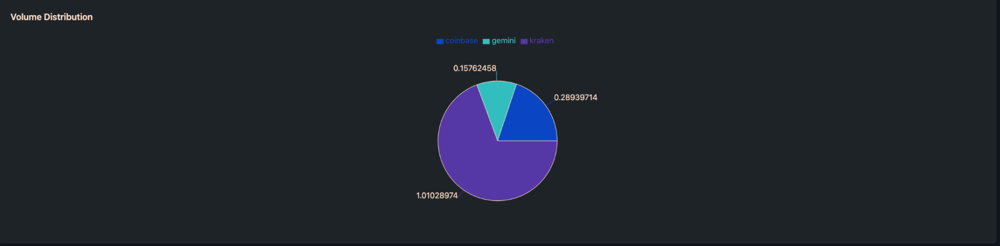
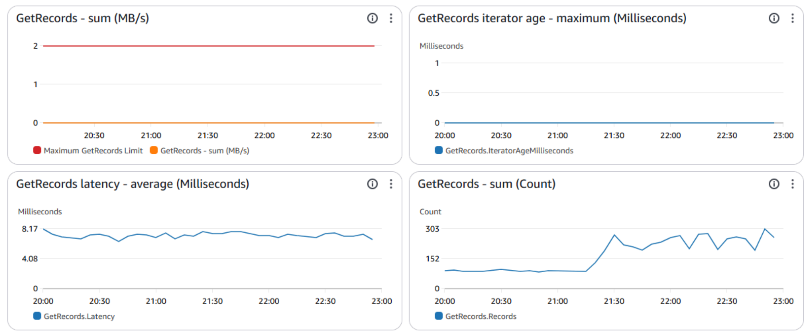
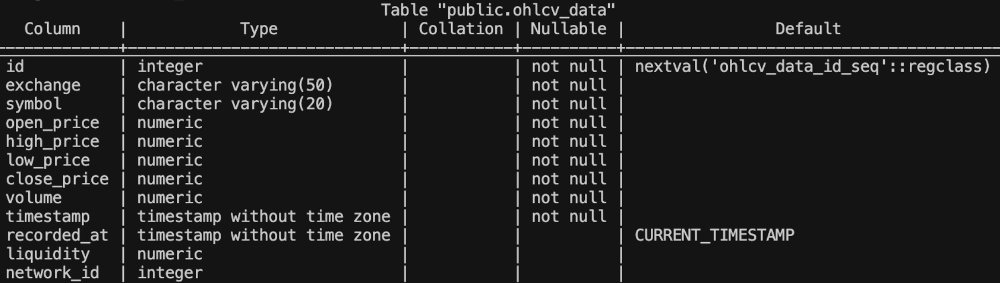
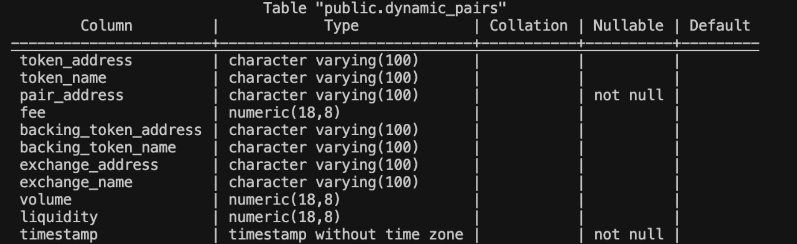
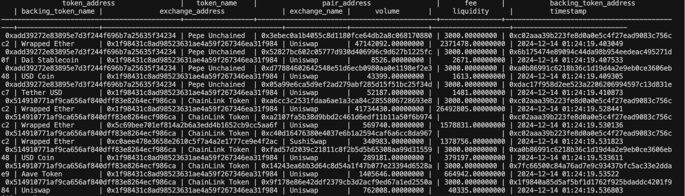

# Liquiditydepth.xyz
Real-Time Liquidity Comparison Dashboard for Centralized and Decentralized Crypto Exchanges

### Note
This project started out as an intern/course project. Although this repo holds the open-source code to the current site liquiditydepth.xyz, olders versions of the project are on the gitlab: https://gitlab.engr.illinois.edu/ie421_high_frequency_trading_fall_2024/ie421_hft_fall_2024_group_04/group_04_project

## Objective
The primary objective of this project is to develop a web-based dashboard that streams real-time data from major decentralized exchanges (DEXs) and centralized exchanges (CEXs). This dashboard will provide users an intuitive interface to compare liquidity and price for top trading pairs across multiple venues/networks. The goal is to identify the exchanges that offer the most liquidity and lowest-cost execution environments for traders.

## Background and Motivation 
Liquidity plays a crucial role in the efficiency of cryptocurrency markets. Traders seek venues where they can execute trades with minimal slippage and competitive transaction costs. While centralized exchanges traditionally dominate liquidity, liquidity in decentralized exchanges has grown significantly, especially with the rise of automated market makers (AMMs) and liquidity pools. However, traders often struggle to compare liquidity across exchanges due to differences in trading mechanisms, fee structures, and available data.

This project addresses the need for a unified platform aggregating liquidity information across DEXs and CEXs. By providing real-time data on liquidity, the dashboard will empower traders to make more informed decisions about where to execute trades, potentially improving their trading outcomes and reducing transaction costs.

## Methodology
The development of the dashboard involves several key components, each crucial for ensuring accurate, timely, and actionable data delivery:

### 1. Data Sources and Collection
* CEX data collection: We leveraged the CCXT library and used a WebSocket connection to stream data for various pairs from top exchanges 
* DEX data collection: We used Codex.io, utilizing API calls for token/pair data and Websocket connections to get candlestick data for specific pairs

### 2. Data Streaming and Processing
Data Processing and Enrichment: Calculate effective spreads, average trade execution costs, slippage at different trade sizes, and historical liquidity trends. The system should also aggregate data for different asset pairs, allowing users to compare liquidity across markets.

### 3. Frontend Visualization  
The front end includes a user-friendly, interactive dashboard displaying key real-time metrics. Users can filter data by specific exchanges, asset pairs, and time intervals. We built the front end using React Js with TypeScript, leveraging Tailwind CSS for styling and Recharts for sophisticated data visualization components. The application features a dual-panel system that handles centralized (CEX) and decentralized (DEX) exchange data through an intuitive interface with interactive charts, including real-time liquidity depth, spread analysis, and volume distribution visualizations.

(Example: BTC/USDT)


Price chart for specific pairs showing different exchanges.


Bar Chart visualizing the spread for specific pair.


Pie chart visualizing volume of pair across exchanges.


### 4. Backend and Data Infrastructure

Architecture:
1. Data ingestion processes stream live DEX/CEX data 
2. Data published to Kinesis stream 
3. Post-processing subscribes to Kinesis stream
4. Processed data stored in PostgreSQL
5. API serves data from PostgreSQL to frontend

Our services are hosted on AWS. Our backend services support:
  - Real-Time Data Ingestion: A data pipeline continuously ingests and processes live data streams from DEXs and CEXs. Use WebSocket connections where available for low-latency data, and fall back on REST API polling for exchanges that lack WebSocket support.
  - Kinesis Stream: Incoming liquidity data is streamed using AWS Kinesis for real-time data processing. Data ingestion processes publish liquidity data to Kinesis with appropriate partition keys, and data post-processing processes subscribe to the Kinesis stream. This ensures high observability, scalability, and low latency in data ingestion, processing, and visualization pipelines.
  - Scalable PostgreSQL database: Data is stored in an AWS PostgreSQL database with auto-scaling enabled to handle sudden spikes in ingest and outgoing traffic. To prepare for long-term running, table schemas are specifically normalized to reduce redundant storage.
  - Compute hosting: all processes, such as data ingression, post-processing, and API serving, are hosted on one EC2 instance with high bandwidth. 
  - Cost optimization: we choose burstable EC2 instance types to reduce cost during regular workload. The database is designed to minimize unnecessary columns. The Kinesis stream is determined to be auto-scalable based on workload.


Key Features:
* High observability and scalability
* Low latency processing
* Cost-optimized infrastructure
* Auto-scaling capabilities
* Normalized database design


## Challenges and Considerations

### API Rate Limits and Data Accessibility 
This section handles rate limits imposed by exchange APIs and potential changes in data access policies.

### Data Scalability and Standardization Across Venues
With multiple streams of live data across different venues and providers, the scalability of data streams became an issue in terms of where we hosted stream producers and consumers. Additionally, inconsistencies within the streamed data, such as missing or different data, made it difficult to store and analyze data within the database. 

## Codebase/Technical Details

### Visualizations
The frontend framework is organized with a component-based architecture where CEXpanel and DEXpanel are the main container components, managing data fetching and state. Data is queried through HTTP requests to an API endpoint, with parameters encoded in base64 for URL parameter safety. The fetched data is then processed through utility functions that transform the raw JSON responses into structured formats suitable for visualization.

The visualization layer consists of three main graph components:
* LiquidityChart: Processes timestamp-based price data into high/low time series data with custom zoom functionality
* Spreadshirt: Aggregates high-low spreads across exchanges into comparative bar charts
* VolDist: Transforms selected volume data into a pie chart by calculating the most recent trading volumes for each exchange

### AWS Kinesis Streams
The kinesis_test directory implements a custom TypeScript interface to interact with AWS Kinesis, bridging the gap between AWS's Java-based Kinesis Client Library (KCL) and our TypeScript application. The producer side implements WebSocket connections to various cryptocurrency exchanges, collecting real-time market data and streaming it to Kinesis shards. The consumer side processes these streams and sends the data to our database. Since AWS's KCL is primarily Java-based, we created our own TypeScript abstractions using AWS SDK v3, implementing features like automatic shard handling, batch publishing, and checkpoint management while maintaining type safety throughout the application.



## Websocket and API Data Producers

### CCXT Implementation
The project implemented two distinct data collection approaches through CCXT (Cryptocurrency Exchange Trading Toolkit) and Codex.io's GraphQL API:

The ccxt_script.py and ccxtProducer.ts establish connections to centralized exchanges (Coinbase, Gemini, Kraken) through CCXT's unified API. We fetch OHLCV (Open, High, Low, Close, Volume) data and order book depth to calculate liquidity within a 1% price range of the current market price. The TypeScript producer maintains continuous WebSocket connections, collecting data at 1-minute intervals and streaming it to AWS Kinesis.

### Codex.io Integration
Through codex_script.py, codexWSProducer.ts, and some other files, we interface with Codex.io's GraphQL API to gather DEX (Decentralized Exchange) data. The GraphQL queries fetch:
* Network information across multiple chains (Ethereum, Polygon, Arbitrum)
* Token pair data, including addresses and exchange metadata
* Real-time OHLCV metrics through WebSocket subscriptions
* Market depth and volume information for specific trading pairs

Both data streams are normalized and published to AWS Kinesis streams, which are processed and stored in our database through consumer applications. The system maintains consistent data formats despite the different sources, allowing unified visualization on our front end.

### DB and Middleware
This Flask API in "middleware/app.py"  serves as a middleware interface between clients and a PostgreSQL database. Since the application is designed for data retrieval only, it focuses exclusively on GET endpoints. The system utilizes psycopg2 for database connections, with configuration details securely managed through environment variables loaded via python-dotenv. To safely handle special characters and symbols in URLs, the API implements base64 URL-safe encoding/decoding for parameters through custom unhash_str and unhash_list functions.

The API offers several key endpoints, each serving different data needs. The OHLCV endpoints handle multiple exchanges and symbols, using SQL queries with window functions for data sampling. The dynamic pairs endpoint manages token pair relationships, supporting bidirectional pair matching and integrating with static token data. To optimize response payload sizes and maintain consistent data density, the API employs a sampling strategy through the sample_rows function, which evenly distributes data points across time series data.

Error handling is implemented comprehensively throughout the application, with consistent error response formatting using jsonify and appropriate HTTP status codes. All database operations are wrapped in try-except blocks with proper connection cleanup in the "finally" blocks. Security considerations are addressed through CORS support via flask_cors, environment variable configuration, and the exclusive use of read-only operations. The API also emphasizes query optimization through prepared statements to prevent SQL injection.

The database is designed to track and store cryptocurrency trading data across both centralized and decentralized exchanges. Here are a couple of database table examples we use:

This table stores the core trading data with Open, High, Low, Close, and Volume (OHLCV) information. The network_id field specifically identifies different blockchain networks for DEX data.


Tracks individual token metrics over time, which is particularly useful for DEX token analysis.



## Future considerations:
### Data Diversification:
Currently, our visualization only supports select pairs and exchanges, and we look to aggregate more data from different exchanges and pairs into our data stream.
### DB management: 
Since we are ingesting high volumes of data, we need to take more steps to manage our database. In the future, we would integrate regular VACUUM operations, data archiving, and query performance monitoring


# Running Instructions

## Overview
This application consists of three main components that need to run simultaneously:
1. Middleware (App.py)
2. Producer/Subscriber
3. Frontend (Liquidity Depth)

### 1. Middleware
Navigate to the /middleware directory and run:

```
python3 app.py
```


### 2. Producer/Subscriber instance (Similar run instructions for other producer/consumer files)
Navigate to the /kinesis_test/src directory and run:

```
npm run tsx codexWSProducer
```


### 3. Frontend
Navigate to the /liquidity-depth directory and run:

```
npm run dev
```


## Requirements
- Python 3.x
- Node.js & npm
- All dependencies installed in respective directories


## Team members

### Sameer Komoravolu
Hello everyone! I’m Sameer Komoravolu, part of the BS/MCS program, graduating in Spring 2026. I have research and internship experience with deep learning & IOT. I am passionate about algorithms and the math that goes into the technology we use every day, and I hope to learn more about software development and am open to any research topics and projects. I play a lot of tennis and ping pong, so feel free to reach out!
* Email: skomo2@illinois.edu
* Linkedin: https://www.linkedin.com/in/sameer-komoravolu-80a7ba229/

### Hanbo Guo
This is Hanbo Guo, a MS CS student interested in radar sensing. I am proficient in system engineering and data engineering. I interned in Tencent as a data engineer in 2023 and NVIDIA as a system engineer in 2024. I will join TikTok as a Research Engineer in ML Sys in 2025. In my spare time, I am a SUI chain enthusiast and I am actively developing an atomic arbitrage strategy. 
* Email: hanbog2@illinois.edu

### Kevin Huang
Hey my name is Kevin, a current undergraduate in CS interested in networking architecture and computational neuroscience. I am currently a course assistant for UIUC’s computer architecture course and doing research for latent representations of brain functions using deep learning. In my free time, I enjoy attending jazz/symphony concerts and going to the gym. I enjoy meeting new people, so please don;t hesitate to reach out!
* Email: kh47@illinois.edu
* LinkedIn: https://www.linkedin.com/in/kevin-mc-huang/

### Akshat Gupta
Hi, My name is Akshat Gupta, a current undergraduate in CS interested in AI and crypto. I am currently a course assistant for UIUC’s data structures course. In my free time, I am interested in health/working out and learning about new things. Feel free to reach out and chat!
* Email: akshatg4@illinois.edu
* Linkedin: https://www.linkedin.com/in/akshatgupta124/
